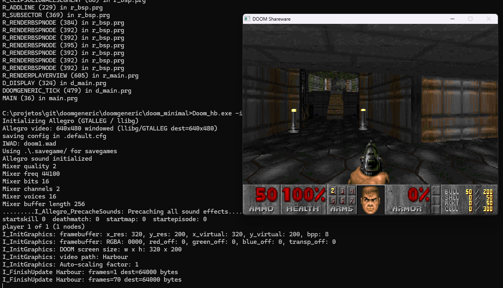

# doom_hb



DOOM generic portado para Harbour, com interfaces mínimas em C para acesso ao Allegro 4.2.2.

Por **Wagner Nunes da Silva**

- vagucs@bol.com.br
- vagucs@vagucs.com.br
- vagucs@gmail.com
- [www.vagucs.com.br](https://www.vagucs.com.br)

Versão em inglês: [README.en.md](README.en.md)

---

## O que é este projeto

O motor do Chocolate Doom / doomgeneric (lógica do jogo, renderer, menu, HUD, WAD, som de alto nível) está em **Harbour** (arquivos `.prg` / `.ch`).

A janela é criada pelo Harbour GT **GTALLEG** / **llibg** (`config_driver`, `config_lib`, `SetMode`), não por `set_gfx_mode` direto. O framebuffer interno do DOOM continua 320×200 em 8 bits (`I_VideoBuffer`).

O executável gerado é `Doom_hb.exe`.

É necessário um IWAD legal (shareware `doom1.wad` ou comercial `doom.wad` / `doom2.wad` / etc.).

---

## O que ficou em C, e por quê

O C **não** é o motor do jogo. Ele existe só onde Harbour não consegue falar com a API nativa, ou onde o original depende de overflow e ponteiros de 32/64 bits.

### 1. Ligação Harbour ↔ Allegro 4 (`#pragma BEGINDUMP`)

O Allegro 4 é uma biblioteca C (`BITMAP *`, `SAMPLE *`, `MIDI *`, paleta, `stretch_blit`, fila de teclado, mixer). Harbour não acessa esses ponteiros sem um wrapper `HB_FUNC`.

| Arquivo | O que o C faz | Motivo |
|---|---|---|
| `doomgeneric_allegro.prg` | Bitmap temporário, paleta 8 bits, `stretch_blit`, teclado, ticks, título da janela | Hardware/API do Allegro; blit por pixel em Harbour é lento demais para 35 fps |
| `i_video.prg` | Blit opcional em C (`IVideoSetPalette` / `IVideoFinishUpdate`) | O vídeo roda **100% em Harbour** por padrão. Se ficar lento demais, use `-videoc` para copiar e escalar o framebuffer 320×200 em C |
| `i_allegrosound.prg` | Mixer, samples, vozes, volume/pan | `SAMPLE *` e mixer do Allegro |
| `i_allegromusic.prg` | Load/play/pause de MIDI | `MIDI *` do Allegro |
| `m_fixed.prg` | `FixedMul` / `FixedDiv` em 64 bits | Precisa do mesmo overflow/shift do DOOM original (`FRACBITS = 16`) |
| `i_system.prg` | `malloc` e `MessageBox` do Windows | Zona de memória por ponteiro C; caixa de erro nativa |
| `d_iwad.prg` | Leitura do registro do Windows | Procurar IWADs instalados pelo jogo original |
| `m_misc.prg` | OEM → UTF-8 | Conversão Win32 de página de código |

### 2. GT Allegro / xAllegro (C de terceiro)

Compilados pelo `doom_hb.hbp`:

| Arquivo | Função |
|---|---|
| `xAllegro/gtallegd.c` | GT Harbour sobre Allegro. Em modo jogo (`AllegGameVideo(.T.)`) o refresh do console **não** sobrescreve a tela; `alleg_present_bitmap` faz o stretch para a janela |
| `xAllegro/ssf.c` | Fonte do GT |
| `xAllegro/ambiente.prg` | Wrappers (`_set_window_title`, resolução do desktop, etc.) |

Sem esse C, o Harbour não cria a janela DirectX (`GFX_DIRECTX_WIN`) nesse stack.

### 3. O que **não** entra na compilação Harbour

| Pasta | Papel |
|---|---|
| `base_c/` | Cópia de referência do DOOM em C. **Não** é compilada por `compile.bat` |
| `.hbmk/` | C gerado automaticamente pelo `hbmk2` a partir dos `.prg`. Não editar |

---

## Como compilar

### Requisitos (Windows)

- Harbour com `hbmk2` em `C:\HARBOUR\BIN`
- MinGW 4.8.1 em `c:\mingw-4.8.1` (gcc, libs)
- Allegro 4.2.2 estático: `c:\mingw-4.8.1\lib\liballeg.a`
- Compatibilidade xHarbour: `hbmk2 -lxhb`

### Compilar o port Harbour (o que você usa)

Na pasta do projeto:

```bat
compile.bat
```

Isso chama:

```bat
hbmk2 -lxhb doom_hb.hbp
```

Saída: `Doom_hb.exe`.

Feche o jogo antes de recompilar. Se `Doom_hb.exe` estiver aberto, o linker falha com *Permission denied*.

### Compilar o C de referência (opcional)

`build.bat` + `Makefile` geram um `Doom_hb.exe` a partir de `base_c/`. Não é o port Harbour.

---

## Como executar

Coloque o IWAD na mesma pasta do executável (ou passe o caminho):

```bat
Doom_hb.exe
Doom_hb.exe -iwad doom2.wad
Doom_hb.exe doom2.wad
```

Sem parâmetro, procura nesta ordem: `-iwad`, um argumento `*.wad`, busca estilo Chocolate Doom, depois arquivos locais (`doom1.wad`, `doom.wad`, `doom2.wad`, `plutonia.wad`, `tnt.wad`, Freedoom).

O boot mínimo começa em **E1M1 / MAP01**, habilidade **Hurt Me Plenty** (`MINIAL_*` em `boot.ch`).

---

## Teclas (padrão)

Controles clássicos do DOOM. Dá para remapeá-los em `default.cfg` / `doom_hbdoom.cfg`.

### Movimento e ação

| Tecla | Ação |
|---|---|
| Setas | Frente, trás, virar |
| **Shift** | Correr |
| **Alt** | Strafe (segurar) |
| **,** / **.** | Strafe esquerda / direita |
| **Ctrl** (esquerdo) | Atirar |
| **Espaço** | Usar / abrir porta |
| **1**–**8** | Trocar arma |
| **Pause** | Pausar |
| **Tab** | Abrir / fechar o mapa |

### Mapa (com o mapa aberto)

| Tecla | Ação |
|---|---|
| Setas | Mover o mapa |
| **+** / **-** | Zoom |
| **0** | Zoom máximo |
| **F** | Seguir o jogador |
| **G** | Grade |
| **M** | Marcar posição |
| **C** | Limpar marcas |
| **Tab** | Fechar o mapa |

### Menu e funções

| Tecla | Ação |
|---|---|
| **Esc** | Menu |
| **Enter** | Confirmar / avançar |
| **Backspace** | Voltar |
| **Y** / **N** | Sim / Não |
| **F1** | Ajuda |
| **F2** | Salvar |
| **F3** | Carregar |
| **F4** | Volume |
| **F5** | Detalhe gráfico |
| **F6** | Quick save |
| **F7** | Encerrar o jogo |
| **F8** | Mensagens |
| **F9** | Quick load |
| **F10** | Sair |
| **F11** | Gamma |
| **=** / **-** | Tamanho da tela |
| **Alt+Enter** | Alternar tela cheia |

### Mouse

| Botão | Ação |
|---|---|
| Esquerdo | Atirar |
| Direito | Strafe |
| Meio | Andar para frente |
| Clique duplo | Usar (se `dclick_use` estiver ligado) |

### Cheats (só nostalgia)

Digite no teclado durante o jogo, sem Enter:

| Código | Efeito |
|---|---|
| **IDDQD** | Modo Deus (*Degreelessness Mode*) |
| **IDKFA** | Todas as armas, munição, chaves e armadura |

---

## Parâmetros da linha de comando

Estes funcionam no boot atual (`doom_hb_Create` → `D_DoomMainMinimal`).

### IWAD

| Parâmetro | Descrição |
|---|---|
| `-iwad arquivo.wad` | IWAD a carregar (caminho ou só o nome) |
| `arquivo.wad` | Mesmo efeito, sem `-iwad` |

### Vídeo

O vídeo roda **100% em Harbour** por padrão (paleta e `I_FinishUpdate`). Se ficar lento demais, use `-videoc`.

| Parâmetro | Descrição |
|---|---|
| `-videoc` | Usa o caminho em C para paleta e blit do framebuffer (alternativa mais rápida) |
| `-scaling N` | Fator de escala do 320×200 (1–8). Sem isso, calcula sozinho |
| `-gfxmode rgba8888` | Framebuffer 32 bpp (padrão se não for CMAP256) |
| `-gfxmode rgb565` | Framebuffer 16 bpp |
| `-fullscreen` | Tenta tela cheia no Allegro |
| `-crt` | Filtro de monitor CRT: curvatura do tubo, scanlines, máscara RGB de fósforo e vinheta. Funciona em janela e em tela cheia |

Na inicialização o log mostra `I_InitGraphics: video path: Harbour` ou `C`.

### Som

| Parâmetro | Descrição |
|---|---|
| `-nosound` | Sem SFX e sem música |
| `-nosfx` | Sem efeitos |
| `-nomusic` | Sem música |

### Configuração e sistema

| Parâmetro | Descrição |
|---|---|
| `-config arquivo.cfg` | Arquivo principal de configuração |
| `-extraconfig arquivo.cfg` | Config extra |
| `-mb N` | Megabytes da zona de memória |
| `-nogui` | Não mostra `MessageBox` em erro fatal |
| `-setmem ...` | Dump de memória estilo DOS (depuração) |

---

## Estrutura resumida

```
doom_hb.hbp          projeto hbmk2
compile.bat          compilação Harbour
main.prg             cria a janela GTALLEG e chama doom_hb_Create()
boot.prg             escolhe o IWAD e sobe o jogo
*.prg / *.ch         motor em Harbour
xAllegro/            GT Allegro + wrappers C
```

---


## Doe

### Ethereum

`0x1b64038A2b1DB73ABd0068d8B9B0d1dC5a90C5F1`


### PIX

Chave: `vagucs@bol.com.br`


